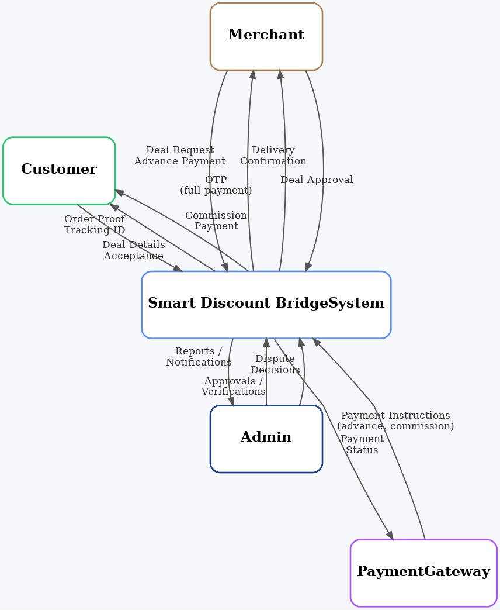
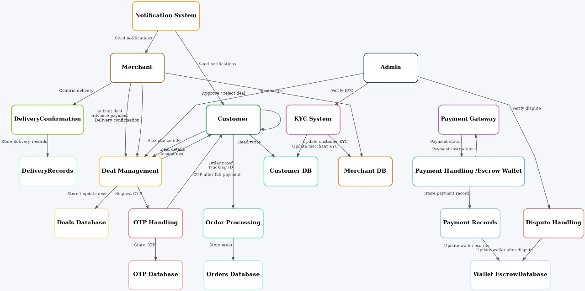
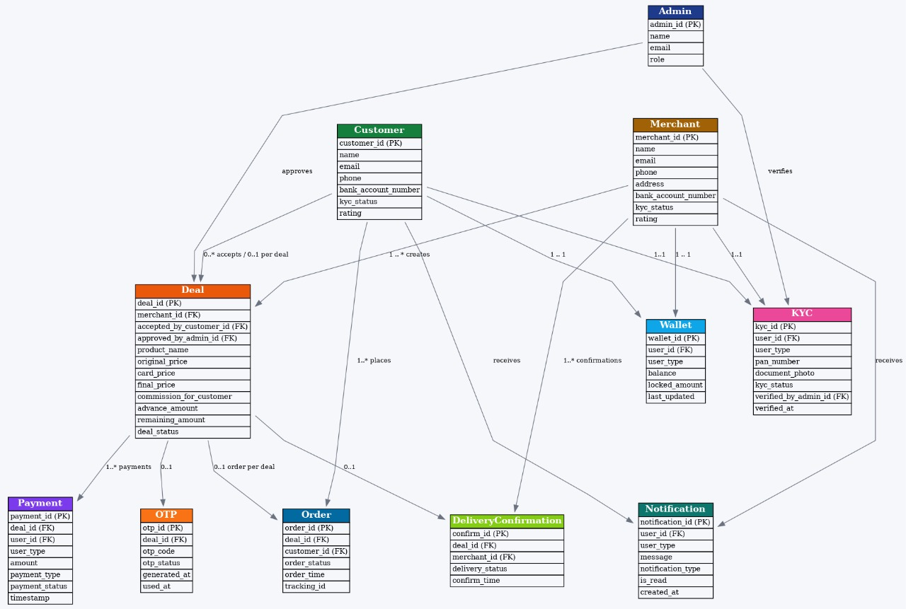

<<<<<<< HEAD
# 🚀 Offer Bridge – Smart Discount & Escrow Platform

Offer Bridge is a **full-stack MERN platform** that securely connects **users who don’t have credit cards** with **credit card holders**, enabling them to access card-based discounts through an **admin-controlled escrow system**.

🔗 **Live Demo:** https://offer-bridge.onrender.com  
📦 **GitHub Repository:** https://github.com/AmitKK10/Offer-Bridge  

---

## 📌 Problem Statement

Many people miss out on online discounts because they **do not own credit cards**, while many credit card holders **do not fully utilize their card benefits**.

There is no trusted platform that safely connects these two groups while preventing fraud, payment disputes, and misuse.

---

## 💡 Solution Overview

Offer Bridge solves this problem by introducing a **secure, escrow-based system** where:

- Merchants request purchases without owning a credit card  
- Customers place orders using their credit cards and earn commission  
- Admin verifies every step and controls payment release  

Funds are **locked in escrow** and released **only after successful delivery confirmation**.

---

## 👥 User Roles

### 🧑‍💼 Merchant
- Creates deal requests
- Pays advance only after admin approval
- Tracks order status and delivery OTP
- Receives settlement after deal completion

### 🧑‍💻 Customer
- Views approved & funded deals
- Accepts a deal (time-bound lock)
- Places order using credit card
- Submits order proof and delivery OTP
- Earns commission after completion

### 🛡️ Admin
- Reviews and approves deals
- Sets commission distribution
- Verifies order proof
- Confirms delivery OTP
- Controls escrow release
- Handles disputes and reports

---

## 🔁 System Flow (High-Level)

1. Merchant creates deal → **PENDING**
2. Admin reviews and approves → **APPROVED**
3. Merchant pays advance → **ESCROW LOCKED**
4. Customer accepts deal (30-minute lock)
5. Customer submits order ID & proof
6. Admin verifies order → **ORDER VERIFIED**
7. Customer submits delivery OTP
8. Escrow released
9. Deal marked **COMPLETED**

---

## 🧠 System Architecture & Diagrams

### Data Flow Diagram (Level 0)


### Overall System Architecture


### Entity Relationship Diagram (ER)


---

## ✨ Key Features

- 🔐 Escrow-based payment locking
- 👥 Role-based dashboards (Merchant / Customer / Admin)
- 💳 Razorpay payment gateway integration
- 💰 Wallet system with available & locked balance
- ⚡ Real-time updates using Socket.IO
- 🔑 OTP-based delivery confirmation
- 📜 Immutable transaction & wallet history
- 🛡️ Admin-controlled verification at every stage

---

## 🧱 Tech Stack

### Frontend
- React (Vite)
- Tailwind CSS
- Axios
- Socket.IO Client

### Backend
- Node.js
- Express.js
- MongoDB
- JWT Authentication
- Socket.IO Server

### Payments
- Razorpay (Test Mode Supported)

### Deployment
- Frontend: Render
- Backend: Render

---

## 🔐 Test Credentials (Live Demo)

### 🛡️ Admin Login
> ⚠️ Admin account cannot be created from UI.

Email: admin@gmail.com

Password: 1234


### 🧑‍💼 Merchant / 🧑‍💻 Customer
- Can be created directly from the application UI using Register option.

---

## ⚙️ Run Locally

### Backend Setup
```bash
cd server
npm install
npm run dev

### Frontend Setup
cd client
npm install
npm run dev

=======
🚀 Offer Bridge – Escrow-Based Deal & Payment Platform

Offer Bridge is a full-stack MERN platform that connects merchants without credit cards to customers who own credit cards, enabling secure, verified, and commission-based purchases using an escrow payment model.

📌 Problem Statement

Many users miss out on card-based discounts because they do not own credit cards.

Many credit card holders do not fully utilize their card benefits.

There is no trusted system to safely connect these two groups.

💡 Solution

Offer Bridge provides a secure, admin-controlled escrow platform where:

Merchants request purchases

Customers place orders using their credit cards

Admin verifies every step

Payments are released only after successful delivery

🧠 Key Features

🔐 Escrow-based payment system

🛡️ Admin verification at every critical stage

👥 Role-based access (Merchant / Customer / Admin)

💰 Wallet system with locked & available balance

⚡ Real-time updates using Socket.IO

💳 Razorpay payment gateway integration

📜 Complete transaction & audit history

👥 User Roles
🧑‍💼 Merchant

Creates deals without immediate payment

Pays advance only after admin approval

Tracks order status and delivery OTP

Receives settlement after deal completion

🧑‍💻 Customer

Views approved & funded deals

Accepts deals with time-based locking

Places order using credit card

Earns commission after successful delivery

🛡️ Admin

Reviews and approves deals

Sets commission distribution

Verifies order proof and delivery OTP

Controls escrow release and wallets

🔁 System Flow (One-Page Summary)

Merchant creates a deal → PENDING

Admin reviews and approves → APPROVED

Merchant pays advance via Razorpay → ESCROW LOCKED

Customer accepts deal (30-min lock)

Customer submits order ID & proof

Admin verifies order → ORDER VERIFIED

Customer submits delivery OTP

Escrow released → commissions credited

Deal marked COMPLETED

💳 Payment & Wallet System

Razorpay is used for advance payments

Advance amount is stored in escrow wallet

Wallet tracks:

Available balance

Locked balance

Transaction history

Funds are released only after successful delivery confirmation

⚡ Real-Time System

Implemented using Socket.IO

Live updates for:

Deal status changes

Wallet balance updates

OTP visibility

Role-based socket rooms:

ADMIN

USER_<id>

🧱 Tech Stack
Frontend

React (Vite)

Tailwind CSS

Axios

Socket.IO Client

Backend

Node.js

Express.js

MongoDB (Atlas)

JWT Authentication

Socket.IO Server

Payments

Razorpay (Test & Live mode supported)

Deployment

Backend: Render (Web Service)

Frontend: Render (Static Site)

🔐 Security Features

JWT-based authentication

Role-based route protection

Admin-controlled verification

Escrow payment locking

Secure wallet ledger system

🧪 Test Mode Notes

Razorpay test credentials supported

Fake order IDs & OTPs allowed in test mode

No real money involved during testing
>>>>>>> c40feae86e30f723e722024de8f2103198d80d35
